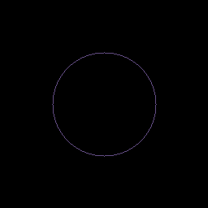

# Midpoint Circle Algorithm

No dependencies. Output is done via [PPM images](http://netpbm.sourceforge.net/doc/ppm.html)

## Quick Start

```console
$ python3 main.py
```

## Screenshots

Random patterns for testing render:

 

Circles: Hollow and Filled:

 

The Wee Wee:

 
